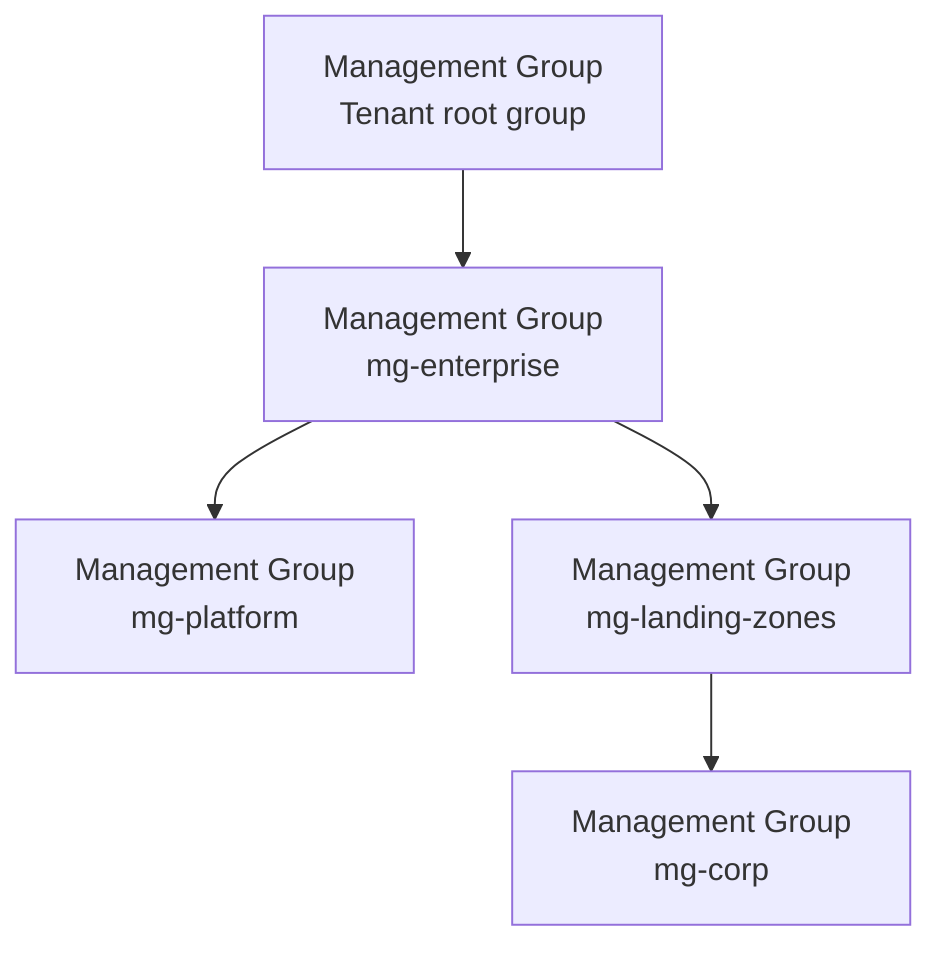
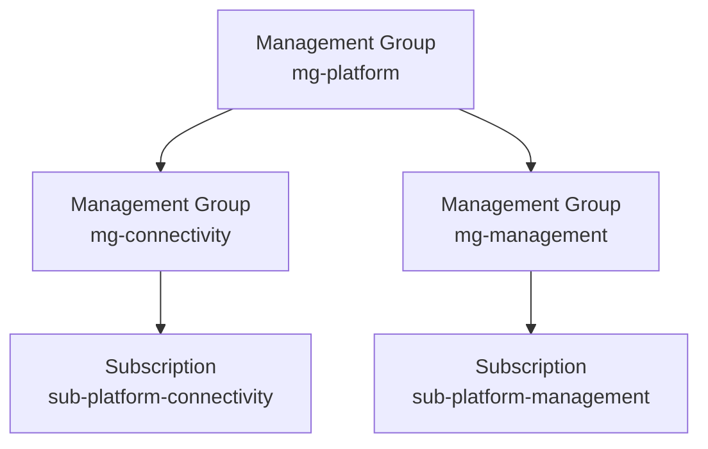
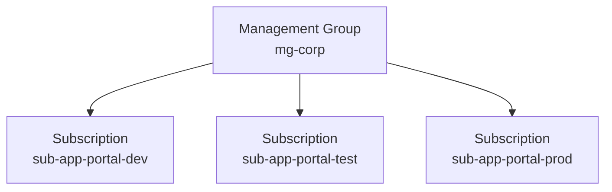
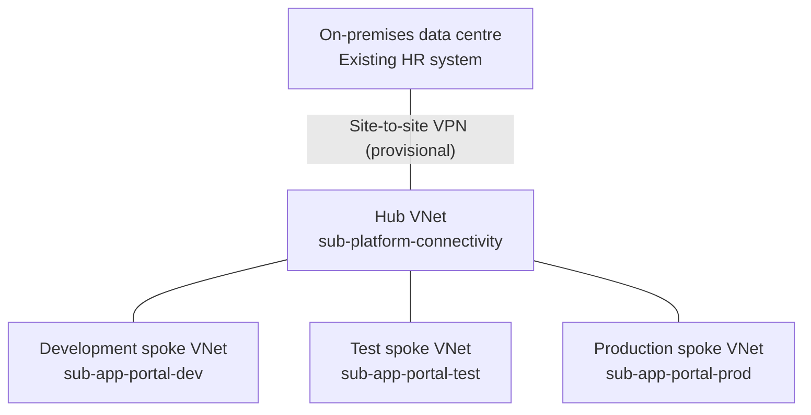

# Target architecture

Status: Design in progress. No Azure resources have been deployed.

This document describes the proposed architecture for the fictional case study.

## Shared connectivity subscription

Proposed name: `sub-platform-connectivity`

### Purpose

Host the shared Azure networking resources, including the Azure side of the connection to the existing on-premises data centre.

The HR system remains on-premises.

### Ownership and access

The platform team manages the shared networking resources.

Application teams use the agreed network connections but are not granted permissions to modify the central networking resources.

### Hub-to-spoke connectivity

VNet peering is proposed for these connections:

- Hub network to the development spoke network.
- Hub network to the test spoke network.
- Hub network to the production spoke network.

No direct peering is planned between development, test,
and production spoke networks.

Peering provides network connectivity but does not replace
network security rules. Permitted traffic must be explicitly
defined and unauthorized traffic blocked.

For approved access to on-premises systems through the shared
VPN gateway, gateway transit settings, routing, and access
controls must be designed and validated separately.

Access to the HR system from development and test remains
an open decision.

Before operational acceptance, test both permitted connections
and the blocking of prohibited connections, including
unauthorized access from non-production to production.

No peering connections have been deployed or tested.

[Microsoft: VNet peering](https://learn.microsoft.com/en-us/azure/virtual-network/virtual-network-peering-overview)

### Rationale

Separate shared networking from application resources to establish clear ownership and manage access permissions and shared network costs independently.

### Trade-off

A separate subscription requires additional administration and coordination between platform and application teams.

### Open decisions

Site-to-site VPN is the provisional connectivity choice; see
[ADR 001](decisions/001-hybrid-connectivity.md).
Detailed network configuration and validation remain open.

## Shared management subscription

Proposed name: `sub-platform-management`

### Purpose

Host shared monitoring resources for the Azure platform.

Collect agreed operational logs centrally and notify the responsible team when configured alert conditions are met.

Applications remain in their own subscriptions.

### Ownership and access

The platform team manages the shared monitoring resources.

The operations team responds to alerts using agreed support procedures.

Application teams receive access only to the monitoring data relevant to their responsibilities.

### Rationale

Provide a consistent monitoring approach across application environments and support the central monitoring requirement.

### Trade-off

Central monitoring requires ongoing maintenance. Log collection and retention must be controlled to manage costs and protect sensitive information.

### Open decisions

The log sources, retention periods, alert thresholds, and notification recipients still need to be defined.

## Pilot application subscriptions

The employee portal uses a separate subscription for each environment.

### Proposed environments

- `sub-app-portal-dev`: Development of new features and application changes.
- `sub-app-portal-test`: Testing and acceptance of release candidates.
- `sub-app-portal-prod`: Live employee portal used by employees.

### Ownership and access

The application team manages application resources within the agreed platform governance rules.

Access permissions and deployment identities are scoped to each environment.

Development and test permissions do not grant access to production. Production deployments require explicit approval.

### Rationale

Separate development, test, and production to support environment-specific access control and clear cost ownership.

This separation supports the requirement that changes in non-production must not directly modify production resources.

### Trade-off

Separate environments require additional administration and may duplicate resources.

Reusable Terraform configuration can help maintain consistent settings across environments.

### Open decisions

Application hosting services, detailed role assignments, and network access rules still need to be defined.

The HR integration and test-data approach for non-production environments must also be agreed.

### Planned verification

Verify that development and test identities cannot modify production resources.

Verify that production deployments cannot proceed without the required approval.

Log collection and alert delivery must be tested before operational acceptance.

## Current architecture overview

The following diagrams show the proposed governance hierarchy for the shared platform and the employee portal.

The design assumes one existing Microsoft Entra tenant. No Azure resources have been deployed.

### Top-level governance hierarchy

`mg-enterprise` is the intermediate root management group for the target environment. It sits below the tenant root group.

Common organizational policies for this target environment are assigned to `mg-enterprise`.

`mg-platform` groups the shared platform management groups.

`mg-landing-zones` groups application management groups and provides a scope for common application policies. It includes `mg-corp` for workloads requiring corporate network connectivity.

Policy assignments at the tenant root group are kept to a minimum to avoid unintentionally affecting subscriptions outside this target hierarchy.

The detailed platform and portal hierarchies are shown below. All arrows represent governance hierarchy, not network connections.

### Platform governance hierarchy

The proposed platform management groups separate shared networking
from central monitoring.

Common platform policies are assigned to `mg-platform` and inherited
by its child groups and subscriptions.

Additional networking policies can be assigned to `mg-connectivity`.
Additional monitoring policies can be assigned to `mg-management`.

Arrows show governance hierarchy, not network connections.

### Portal governance hierarchy

Arrows show management group membership, not network connections.

## Proposed network topology

The proposed design uses a hub-and-spoke network topology.
No network resources have been deployed.

### Hub network

One shared virtual network is planned in
`sub-platform-connectivity`.

The platform team manages this network. It provides the
central point for the planned connection to the on-premises
data centre.

### Spoke networks

Each portal environment has its own virtual network:

- Development in `sub-app-portal-dev`.
- Test in `sub-app-portal-test`.
- Production in `sub-app-portal-prod`.

Each spoke is planned to connect to the hub.
This does not automatically permit communication between
environments. Routing and access rules must be explicitly designed.

### Rationale and trade-off

Central connectivity can be shared across application environments.
However, the hub becomes a shared dependency and requires careful
operation and resilience planning.

### Open decisions

- Validation and final approval of the provisional site-to-site VPN choice..
- Network address ranges, routing, DNS, and security controls.
- Permitted access to the HR system from each environment,
  including the non-production test-data approach.

  
### High-level network diagram

Lines represent planned network connectivity, not governance
hierarchy or access permissions.

The VPN choice is provisional and subject to validation.
See [ADR 001: Hybrid connectivity](decisions/001-hybrid-connectivity.md).
No connection has been deployed or tested.

Gateways, routing, DNS, and security controls are not shown
and still need to be designed. Non-production access to the
HR system remains an open decision.

### Reference

[Microsoft: Hub-spoke network topology](https://learn.microsoft.com/en-us/azure/architecture/networking/architecture/hub-spoke)
