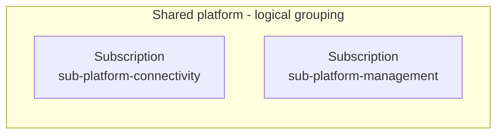
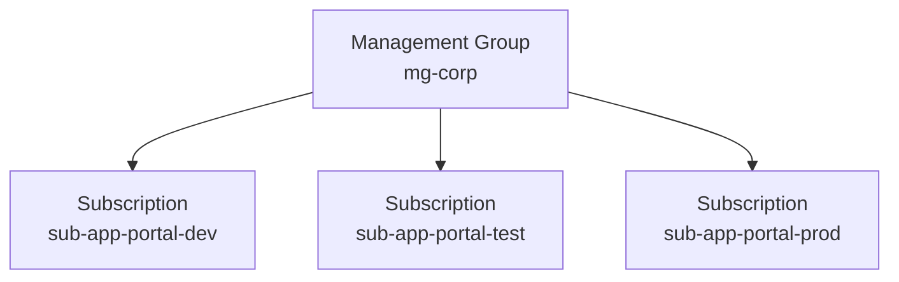

# Target architecture

Status: Design in progress. No Azure resources have been deployed.

This document describes the proposed architecture for the fictional case study.

## Shared connectivity subscription

Proposed name: `sub-platform-connectivity`

### Purpose

Host the shared Azure networking resources, including the Azure side of the connection to the existing on-premises data centre.

The HR system remains on-premises.

### Ownership and access

The platform team manages the shared networking resources.

Application teams use the agreed network connections but are not granted permissions to modify the central networking resources.

### Rationale

Separate shared networking from application resources to establish clear ownership and manage access permissions and shared network costs independently.

### Trade-off

A separate subscription requires additional administration and coordination between platform and application teams.

### Open decisions

The connection type and detailed network topology still need to be selected.

## Shared management subscription

Proposed name: `sub-platform-management`

### Purpose

Host shared monitoring resources for the Azure platform.

Collect agreed operational logs centrally and notify the responsible team when configured alert conditions are met.

Applications remain in their own subscriptions.

### Ownership and access

The platform team manages the shared monitoring resources.

The operations team responds to alerts using agreed support procedures.

Application teams receive access only to the monitoring data relevant to their responsibilities.

### Rationale

Provide a consistent monitoring approach across application environments and support the central monitoring requirement.

### Trade-off

Central monitoring requires ongoing maintenance. Log collection and retention must be controlled to manage costs and protect sensitive information.

### Open decisions

The log sources, retention periods, alert thresholds, and notification recipients still need to be defined.

## Pilot application subscriptions

The employee portal uses a separate subscription for each environment.

### Proposed environments

- `sub-app-portal-dev`: Development of new features and application changes.
- `sub-app-portal-test`: Testing and acceptance of release candidates.
- `sub-app-portal-prod`: Live employee portal used by employees.

### Ownership and access

The application team manages application resources within the agreed platform governance rules.

Access permissions and deployment identities are scoped to each environment.

Development and test permissions do not grant access to production. Production deployments require explicit approval.

### Rationale

Separate development, test, and production to support environment-specific access control and clear cost ownership.

This separation supports the requirement that changes in non-production must not directly modify production resources.

### Trade-off

Separate environments require additional administration and may duplicate resources.

Reusable Terraform configuration can help maintain consistent settings across environments.

### Open decisions

Application hosting services, detailed role assignments, and network access rules still need to be defined.

The HR integration and test-data approach for non-production environments must also be agreed.

### Planned verification

Verify that development and test identities cannot modify production resources.

Verify that production deployments cannot proceed without the required approval.

Log collection and alert delivery must be tested before operational acceptance.

## Pilot application subscriptions

The employee portal uses a separate subscription for each environment.

### Proposed environments

- `sub-app-portal-dev`: Development of new features and application changes.
- `sub-app-portal-test`: Testing and acceptance of release candidates.
- `sub-app-portal-prod`: Live employee portal used by employees.

### Ownership and access

The application team manages application resources within the agreed platform governance rules.

Access permissions and deployment identities are scoped to each environment.

Development and test permissions do not grant access to production. Production deployments require explicit approval.

### Rationale

Separate development, test, and production to support environment-specific access control and clear cost ownership.

This separation supports the requirement that changes in non-production must not directly modify production resources.

### Trade-off

Separate environments require additional administration and may duplicate resources.

Reusable Terraform configuration can help maintain consistent settings across environments.

### Open decisions

Application hosting services, detailed role assignments, and network access rules still need to be defined.

The HR integration and test-data approach for non-production environments must also be agreed.

### Planned verification

Verify that development and test identities cannot modify production resources.

Verify that production deployments cannot proceed without the required approval.

## Current architecture overview

This is a partial view of the proposed architecture. The complete parent management group hierarchy remains to be defined.

### Shared platform subscriptions

The box below is a logical grouping, not an Azure management group.

### Portal governance hierarchy

Arrows show management group membership, not network connections.

